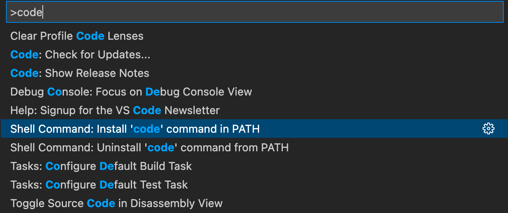
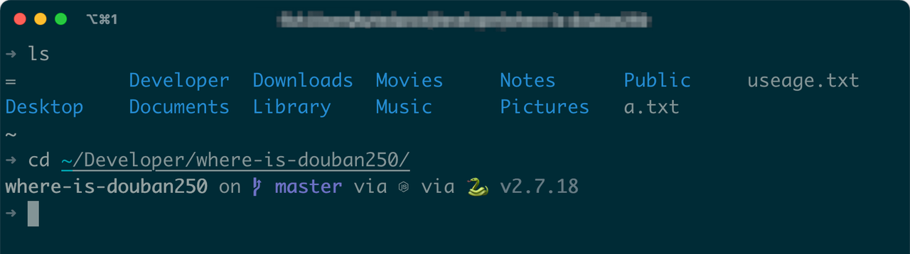
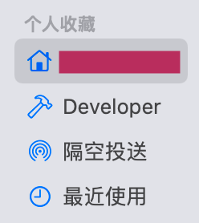

> Author: [@mayandev](https://github.com/mayandev)
> 
> 拿到一台新的 Macbook 时，我应该做什么？
> 
> 按照自己的 Mac 使用习惯写下此份手册，方便使用新的电脑时，可以快速配置好相应的环境以及软件，个人向（偏前端），实用为主，长期维护，不定期更新。

## 软件

-   [Homebrew](https://brew.sh/)，命令的方式安装 App
    
    ```Bash
    # 安装，需要开机密码
    /bin/bash -c  $(curl -fsSL https://raw.githubusercontent.com/Homebrew/install/master/install.sh) 
    ```
-   [Typora](https://typora.io/#download) （很好用的本地 Markdown 编辑器，不过现在收费了，不想付费可以选择替代品 [Obsidian](https://obsidian.md/)、[FSNotes](https://github.com/glushchenko/fsnotes)）
-   [Shiftit](https://github.com/fikovnik/ShiftIt)，可以通过快捷键快速分屏，安装命令 `$ brew install shiftit --cask` ，开源
-   [clipy](https://clipy-app.com/)，剪切板工具，记录历史复制内容，开源
-   [iterm2](https://iterm2.com/)， 非常好用的终端，配合 zsh or fish 使用
-   [fig](https://fig.io/)，命令行提示工具
-   [The Unarchiver](https://theunarchiver.com/)，必备解压工具
-   [Mos](https://github.com/Caldis/Mos)，平滑鼠标滚动效果，或单独设置滚动方向的小工具
    

## 环境

-   vscode 配置一个 code 的启动命令，`shift+cmd+p` 打开命令面板，输入 code 并选择 install，这样就可以通过`code ./dir/`命令行直接打开指定文件夹。
		
    

    -   登陆账号同步自己设置以及常用插件(待更新...)
-   [iterm2](https://iterm2.com/) + [fish shell](https://fishshell.com/) + [starship](https://starship.rs/)， fish 有很好的提示（个人认为比 zsh 好用），[starship](https://starship.rs/) 则可以让终端更加智能和好看。
    -   安装 fish: `brew install fish`，命令行输入 `fish` 启用。
    -   安装 omf，是 fish 的增强工具：`curl -L https://get.oh-my.fish | fish`，方便安装插件
    -   切换默认的 shell 为 fish：`chsh -s /usr/local/bin/fish`
    -   NVM 不支持 fish shell，推荐安装这个[插件](https://github.com/jorgebucaran/nvm.fish)，减少配置过程。
    -   安装 starship：`brew install starship`，`vim ~``/.config/fish/config.fish` 的最后，添加以下内容，使shell在启动时加载 starship 和 NVM
    ```Plaintext
    starship init fish | source
    nvm use 14
    ```
    -   starship 本身有预设的配置，自己在其基础上加了一些配置（[参考配置](https://github.com/Mayandev/macbook-starter-handbook/blob/main/starship.toml)），主要作用就是将终端用户名改成“➜”，电脑低于一定电量时显示 💀emoji。输入 `starship config` 打开配置文件，使用 vim 操作。
    -   iterm2 的外观设置直接导入[自用的配置文件](https://github.com/Mayandev/macbook-starter-handbook/blob/main/iterm2_config.json)，系统设置--->Profile--->Other Actions--->Import Json Profile，其中 Non-ASCII 字符使用到了 Nerd Font，需要先[下载并安装](https://github.com/ryanoasis/nerd-fonts/releases/download/v2.1.0/FantasqueSansMono.zip)。
    
    
    

## 设置

### 访达

-   `ctrl+cmd+g` 输入 `/` 进入系统根目录，拖动🏠 user 目录到侧边栏
-   在 user 目录下新建 Developer 文件夹，存放代码，拖放到侧边栏



### Touch Bar

设置：系统偏好设置--->键盘--->自定义功能栏，将默认的 Siri 图标替换为屏幕锁定，方便快速锁屏。


### 触控板

设置轻点来点按：系统偏好设置--->触控板--->轻点来点按，更多手势全选上。

## Chrome 插件

- [FeHelper](https://chrome.google.com/webstore/detail/fehelper%E5%89%8D%E7%AB%AF%E5%8A%A9%E6%89%8B/pkgccpejnmalmdinmhkkfafefagiiiad?utm_source=chrome-ntp-icon)，满足你对前端一切想象的开发工具
- [划词翻译](https://chrome.google.com/webstore/detail/%E5%88%92%E8%AF%8D%E7%BF%BB%E8%AF%91/ikhdkkncnoglghljlkmcimlnlhkeamad/related?hl=zh-CN)，有 Google、Bing 和 DeepL 翻译引擎
- [Vimium](https://chrome.google.com/webstore/detail/vimium/dbepggeogbaibhgnhhndojpepiihcmeb)，在浏览器使用 Vim 的一些快捷键

待更新...
